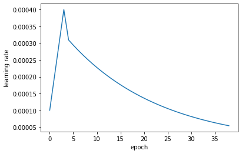

```python
#coding = utf-8
```


```python
from models.cbamResNet import *
from loader.data_loader import *
from tools.other_tools import *
from tools.augment_tools import *
from tools.data_tools import *
from tools.evaluate_tools import *
from tools.model_tools import *
from tools.other_tools import *
from config import config
import torch
from torch import nn,optim
from tqdm import tqdm
```


```python
from torchvision import transforms, utils
transform =  { "train":transforms.Compose([
                transforms.RandomHorizontalFlip(0.5),
                transforms.RandomVerticalFlip(0.1),
                transforms.RandomApply([transforms.RandomRotation(30)], p=0.3),
                transforms.RandomApply([transforms.ColorJitter(brightness=0.5,contrast=0.8)], p=0.5),
                transforms.RandomApply([transforms.ColorJitter(hue=0.2)], p=0.1),
                transforms.RandomApply([transforms.CenterCrop(config.size*0.6)], p=0.4),
                transforms.Resize((config.img_height,config.img_width)),
                transforms.ToTensor(),
                transforms.Normalize(
                mean=[0.485, 0.456, 0.406],
                std=[0.229, 0.224, 0.225])
            ]),
              "val":transforms.Compose([
                transforms.Resize((config.img_height,config.img_width)),
                transforms.ToTensor(),
                transforms.Normalize(
                mean=[0.485, 0.456, 0.406],
                std=[0.229, 0.224, 0.225])
            ]),
                "test" :transforms.Compose([
                transforms.Resize((config.img_height,config.img_width)),
                transforms.ToTensor(),
                transforms.Normalize(
                mean=[0.485, 0.456, 0.406],
                std=[0.229, 0.224, 0.225])
            ])}
```


```python
device = torch.device(config.gpu if torch.cuda.is_available() else "cpu")
seed_everything(config.seed)

exists_or_mkdir(config.weights)
exists_or_mkdir(config.submit)
exists_or_mkdir(config.best_models)
exists_or_mkdir(config.logs)
```


```python
train_data,train_label = get_csv_files(config.train_data,"train")
train_labels = np.ones((len(train_label),config.num_classes))*config.negtive_score
for i in tqdm(range(len(train_label))):
    train_labels[i][train_label[i]] = config.positive_score
train_data,train_label,val_data,val_label = split_rand(train_data,train_labels)
train_dataset = CCDataset(file=train_data,transform=transform["train"],label=train_label)
val_dataset = CCDataset(file=val_data,transform=transform["val"],label=val_label)
print("number of train dataset",len(train_dataset))
print("number of validate dataset：",len(val_dataset))
train_dataloader = DataLoader(train_dataset,batch_size=config.batch_size,shuffle=True,num_workers=4)
val_dataloader = DataLoader(val_dataset,batch_size=config.batch_size * 2,shuffle=True,num_workers=4)

```
loading train dataset

get csv file done

100%|██████████| 142119/142119 [00:00<00:00, 215337.31it/s]

split train and val file...

number of train dataset 113696

number of validate dataset： 28423


```python
show_batch(train_dataset,16)
```


```python
model = get_cbam_resnet_net()
load_weights(model,config.weights+config.model_name+".pkl")
model.to(device)
```

Number of params: 30.627826 Million

load failed

```python
optimizer = optim.SGD(model.parameters(), lr = config.lr, momentum=0.5)
criterion = nn.BCEWithLogitsLoss().to(device)
```


```python
lambda_warmup_step = lambda epoch: epoch if epoch <= config.warmup_peak_epoch else config.warmup_peak_epoch*(0.95 ** epoch)
from torch.optim.lr_scheduler import LambdaLR
scheduler = LambdaLR(optimizer,lr_lambda=lambda_warmup_step)

```


```python
show_lr(scheduler,config.epochs)
```




```python
start_epoch = 0
old_eval_acc = 0.1
old_eval_loss = 0.05


for epoch in range(start_epoch,config.epochs):
    model.train()
    scheduler.step()
    prbar = tqdm(total=len(train_dataloader))
    prbar.set_description("training epoch"+str(epoch))
    for iter,(input,target) in enumerate(train_dataloader):
        input = Variable(input).to(device)
        target = Variable(torch.from_numpy(np.array(target))).to(device)
        output = model(input)
        loss = criterion(output,target)
        loss.backward()
        #backward
        if iter%config.step == 0:
            optimizer.step()
            optimizer.zero_grad()
        prbar.update(1)
        prbar.set_postfix(loss=loss.cpu().detach().numpy())
    prbar.close()
```

valuation loss: 100%|██████████| 889/889 [04:37<00:00,  3.21it/s, loss=17.1]
training epoch0: 100%|██████████| 7106/7106 [17:26<00:00,  6.79it/s, loss=0.6636417094578926]
valuation loss: 100%|██████████| 889/889 [03:07<00:00,  4.74it/s, loss=0.664]
training epoch1: 100%|██████████| 7106/7106 [17:25<00:00,  6.79it/s, loss=0.6191723328473407]
valuation loss: 100%|██████████| 889/889 [01:43<00:00,  8.59it/s, loss=0.625]
training epoch2: 100%|██████████| 7106/7106 [17:26<00:00,  6.79it/s, loss=0.5555043521263846]
valuation loss: 100%|██████████| 889/889 [01:17<00:00, 11.44it/s, loss=0.569]
training epoch3: 100%|██████████| 7106/7106 [17:27<00:00,  6.78it/s, loss=0.4907208155878755] 
valuation loss: 100%|██████████| 889/889 [01:50<00:00,  8.02it/s, loss=0.504]
training epoch4: 100%|██████████| 7106/7106 [17:26<00:00,  6.79it/s, loss=0.4237365526473102] 
valuation loss: 100%|██████████| 889/889 [01:18<00:00, 11.38it/s, loss=0.439]
training epoch5: 100%|██████████| 7106/7106 [17:45<00:00,  6.67it/s, loss=0.3766550269722687] 
valuation loss: 100%|██████████| 889/889 [01:19<00:00, 11.19it/s, loss=0.383]
training epoch6: 100%|██████████| 7106/7106 [17:31<00:00,  6.76it/s, loss=0.33530725580717347]
valuation loss: 100%|██████████| 889/889 [01:17<00:00, 11.42it/s, loss=0.339]
training epoch7:  32%|███▏      | 2303/7106 [05:41<11:50,  6.76it/s, loss=0.3236148598362705]
